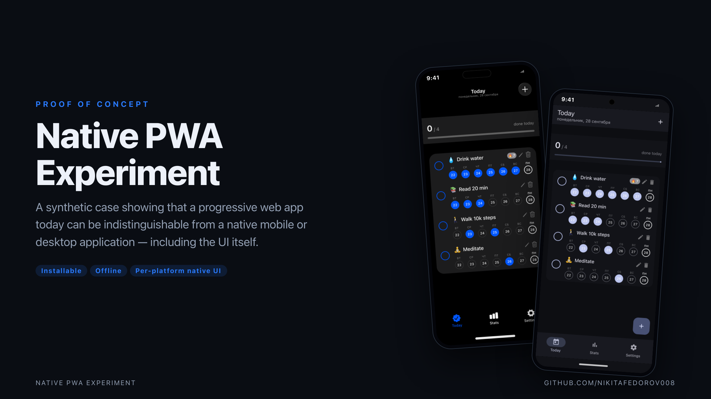
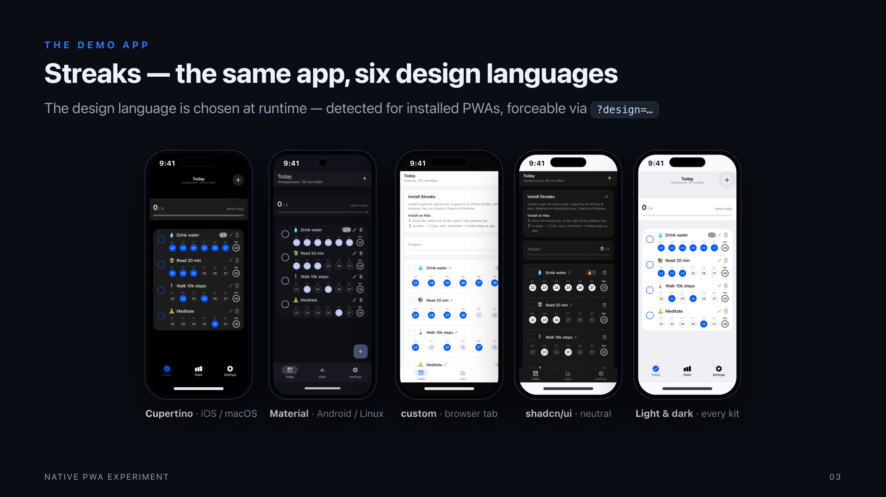
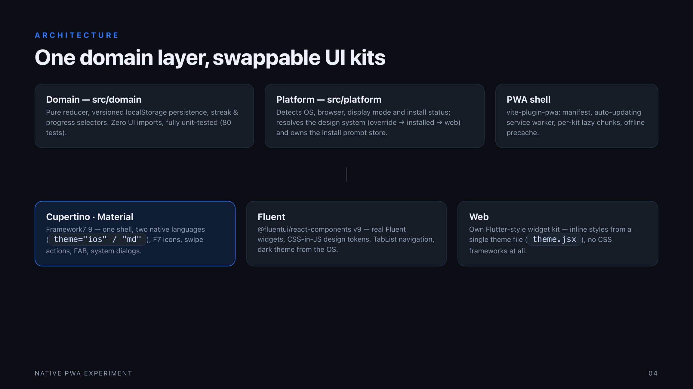

# Native PWA Experiment



**A proof of concept that a progressive web app in 2026 can be indistinguishable from a native mobile or desktop application — including the UI itself.**

This repository is a companion to [whatpwacando.today](https://whatpwacando.today/). That site catalogs *what* browsers can do today; this experiment demonstrates *how it feels*: one synthetic app, shipped as a PWA, that installs to your home screen / dock, works offline, and — the centerpiece — renders itself with the **native design language of your platform**.

## The demo app: Streaks

A small but complete daily habit tracker (progress, streaks, per-day history, add/rename/delete, celebrations). The design language is chosen **at runtime**:

| Design language | Engine | Gets it when |
|---|---|---|
| **Cupertino** | Framework7 (`ios`) | installed on iOS / macOS |
| **Material** | Framework7 (`md`) | installed on Android |
| **Fluent** | Fluent UI v9 | installed on Windows |
| **Yaru** | own code kit | installed on Linux (Ubuntu's language) |
| **custom** | own code kit | browser tab (the app's own brand) |
| **shadcn** | own code kit | preview |

<p align="center">
  
</p>

You can force any language for a preview: `?design=cupertino|material|fluent|yaru|custom|shadcn` (or `?design=auto` to return to detection) — it persists and is also switchable in Settings.

## How it works

<p align="center">
  
</p>

Everything is **TypeScript** in strict mode (`npm run typecheck`), and the code is layered the way
[Flutter's architecture guide](https://docs.flutter.dev/app-architecture/guide) prescribes — UI
(views + view models), Data (repositories + services) and Domain (entities + use cases), wired
together in a composition root. See [docs/architecture.md](docs/architecture.md) for the full mapping:

- **`src/domain`** — entities (`Habit`, `DateKey`), a `Result` type instead of exceptions, and the use
  cases that own the rules (a name is required, a future day cannot be completed, streaks and
  seven-day summaries are derived here). No React, no DOM, fully unit-tested.
- **`src/data`** — services wrap one external thing each (localStorage, the clock and its midnight
  rollover, device detection, the install event, confetti); repositories are the single source of
  truth and re-publish an immutable snapshot on every change.
- **`src/ui`** — one view model per screen: it reads repositories, turns entities into
  presentation-ready items and exposes commands. View models are plain
  [zustand](https://zustand.docs.pmnd.rs/) stores, so they live outside React and views subscribe with
  `useStore`.
- **`packages/ui-kit`** — the design system and the views for all six design languages. It never
  imports application code: the app injects its view models (`src/app/App.tsx`) and TypeScript checks
  that object against the kit's `KitApi` contract. See [its README](packages/ui-kit/README.md).
- **`src/app/services.tsx`** — the composition root: services → repositories → view models, built once.

### Inside the kit

| Kind | Design languages | How |
|---|---|---|
| Native kits | `cupertino`, `material`, `fluent` | real libraries — Framework7 renders one component tree in either Apple or Google language; Fluent UI styles itself from design tokens |
| Code kit | `yaru`, `custom`, `shadcn` | a small Flutter-style widget set styled *only* from tokens in `packages/ui-kit/src/theme.tsx` — adding a language there is a palette plus a behavior block, no new components |

View models are written once and views exist per design language, so a single `HabitStatsView` renders
as an iOS list, a Material list or a Fluent card without any of them duplicating a rule. All
habit-specific styling (check circles, week strips, emoji grid, stat tiles) lives in a single file,
`packages/ui-kit/src/appStyles.ts`, injected as one stylesheet and scoped per kit. There are no `.css`
files in the app or the package.

### What makes it feel native

| Detail | How |
|---|---|
| Installed-mode detection | `display-mode` media queries + `navigator.standalone` switch the whole design language on launch |
| Real install flow | captured `beforeinstallprompt` re-fired from a button; iOS gets per-browser step lists |
| Offline | vite-plugin-pwa service worker precaches the build (`autoUpdate`) |
| Native chrome | safe-area insets, system dark mode, platform typography (SF / Roboto / Segoe / Ubuntu) and icon fonts |
| Platform idioms | FAB + pill tabs (Material), circular checks + swipe-to-delete (Cupertino), TabList (Fluent), headerbar with window controls (Yaru) |
| Lean bundles | each language is a lazy chunk: a browser tab never downloads Framework7, an installed Android user never downloads Fluent UI |

## Run it locally

```bash
git clone https://github.com/nikitafedorov008/NativePWAExperiment
cd NativePWAExperiment
npm install
npm run dev        # http://localhost:5173
npm run build      # static dist/ — host anywhere
npm test           # unit tests (domain + design-system resolution)
npm run typecheck  # tsc --noEmit, strict
```

Open the dev URL in a browser tab for the `custom` look — then **install** the app (banner or browser menu) and launch it from your home screen / dock to see your platform's native language.

## Presentation

A short slide deck about the experiment is included and downloadable:

- [`docs/presentation.pdf`](docs/presentation.pdf) — ready to view/share
- [`docs/slides.html`](docs/slides.html) — the editable source (open in any browser)

## Related solutions & real-world PWAs

- [What PWA Can Do Today](https://whatpwacando.today/) — the capability catalog this experiment pairs with
- [Excalidraw](https://excalidraw.com/) · [Squoosh](https://squoosh.app/) — flagship installable, offline-capable PWAs
- [Starbucks PWA](https://www.starbucks.com/) · [Uber](https://m.uber.com/) · [X](https://x.com/) — production PWAs at scale
- [Framework7](https://framework7.io/) · [Fluent UI React v9](https://react.fluentui.dev/) — the kits that make native looks possible from web code
- [Yaru](https://github.com/ubuntu/yaru) · [Adwaita](https://gnome.pages.gitlab.gnome.org/libadwaita/doc/main/) — the Ubuntu / GNOME design language the `yaru` theme follows
- [Learn PWA (web.dev)](https://web.dev/learn/pwa) · [PWA Stats](https://www.pwastats.com/) — reference material and field statistics

## Scope & honest caveats

A PWA is not a replacement for apps that need deep OS integration (background services, full hardware access, store-only APIs). It **is** a serious answer for everything else — and this repository exists to show how close the gap already is.

## License

[MIT](LICENSE)
